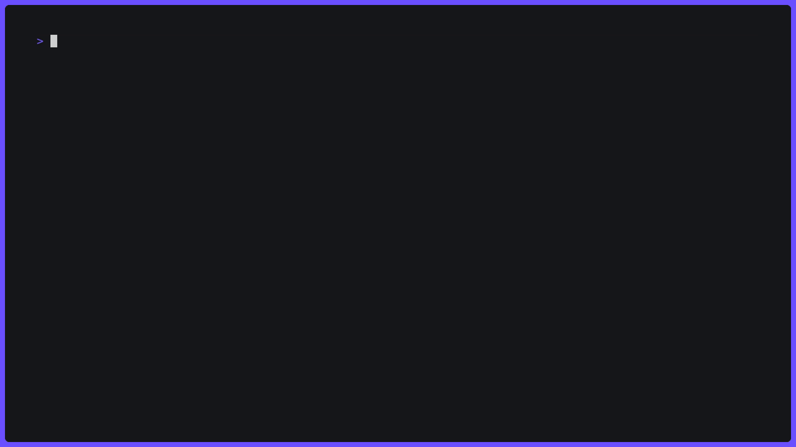

## Vidi


WIP

## Overview

Vidi is a video service (or platform). Features include:
 - simple user registration and login
 - mp4 files upload (with h.264 AVC and mp4a AAC codecs)
 - resuming of interrupted upload
 - upload quotas per user
 - on-demand streaming of uploaded videos with MPEG-DASH

Uploaded mp4 files are pre-processed, so they could be streamed to dash clients. Preprocessing includes:
 - Segmentation (using awesome [Eyevinn/mp4ff](https://github.com/Eyevinn/mp4ff) package)
 - MPD generation (with [Eyevinn/dash-mpd](https://github.com/Eyevinn/dash-mpd))

Also project uses:
- PostgreSQL for video object storage and user storage
- S3 compatible storage for video content
- Redis for media sessions storage

This is my pet project and is very far from being production-ready. Nice and shiny web UI is not even planned.

## Architecture

Vidi consists of several services

### Userapi

Simple user registration and login service. Made with `labstack/echo`.

### Videoapi

Main API that implements the most of the business logic, like video object CRUD operations. It is also an entry point for upload and watch flows.

Video API has service-side (for back2back comms) and user-side (user->api comms) parts. User-side is served as http with `labstack/echo` and as grpc. Service-side has only grpc.

Both Userapi and Videoapi are considered as API-domain.

### Uploader

This service is responsible for media content upload. It uses upload sessions created by videoapi to identify and validate upload requests. Made with `valyala/fasthttp`.

### Streamer

This service serves DASH segments to users. It uses watch sessions created by videoapi to identify and validate download requests. Made with `valyala/fasthttp`.

### Processor

This is worker-style service that processes uploaded videos to DASH-format. Uses `Eyevinn/mp4ff` in its core.

Processor, uploader and streamer are considered as Media-domain.

### Vidit

This is client-side tool, that provides TUI to interact with Vidi. It supports almost every operation, excluding video playback: at the moment it can generate watch url which can be used with DASH reference player (included in compose project). Made with `charmbracelet/bubbletea`.

## Development

`./docker` dir contains reference all-in-one deployment with docker-compose. Nginx is used as gateway. It also has simple web page with DASH reference client to test video playback. Minio is used as self-hosted s3.

### Docker

```bash
# generate certificates
make tls
# start compose project
make docker-dev
# or
make docker-dev-build # to rebuild images

# stop compose project and remove volumes
make docker-dev-clean
```

### Tests

```bash
# run unit tests
make unittests

# run unit and e2e tests
# docker compose project should be stopped (it will be started by the command)
make test-all
```

### Showcase

Showcase of project startup and some features


